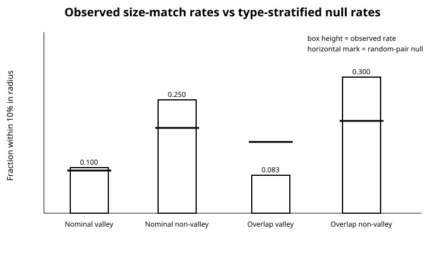

## 6. Analysis

The analysis proceeded in three layers.

First, the nominal-radius analysis asked the most direct observational question: using the currently reported best-fit radii, do valley-inclusive adjacent pairs show less physical similarity? This avoids allowing uncertainty magnitude itself to determine membership, but it underrepresents uncertain true membership near the window boundary.

Second, the hard overlap analysis reproduced the membership logic of the closest Kepler study as closely as the TESS catalog allowed. Because TESS errors are larger, the sample could not sustain a 5% cutoff; the 20% primary cutoff and stricter alternatives were therefore analyzed explicitly. This layer tests what conclusion a direct procedural transfer would produce.

Third, the probabilistic layer treated membership as latent. It asked whether the apparent hard-label result survives when the reported uncertainty is used as a probability distribution rather than as an object-specific window expansion. This is the primary adjudicator when nominal and overlap rules disagree.

The study did not select the reported result from a large unconstrained search. The center values, +/-0.10 Earth-radius window, 10% size-match definition, directional contrast, and adjacency concept were inherited from the closest work. The main discretionary TESS-specific decision was the 20% radius-precision threshold, which is why the result is displayed across the full precision grid.

## 7. Results

### 7.1 Nominal radii do not yield a decisive TESS replication

Under nominal membership, nine unique planets generated 10 valley-inclusive adjacent pairs. One of those 10 pairs was size-matched (10.0%; 95% Wilson interval 1.8%-40.4%). Among 64 non-valley pairs, 16 were size-matched (25.0%; 16.0%-36.8%).

The type-stratified random-pair baselines were 9.44% for valley-inclusive pairs and 18.81% for non-valley pairs. Thus the observed physical enhancements were +0.006 and +0.062, respectively, producing `C = 0.056`.

| Primary result | Nominal membership | Hard 1-sigma overlap |
|---|---:|---:|
| Valley-inclusive pairs | 10 | 24 |
| Valley size matches | 1 | 2 |
| Valley observed rate | 0.100 | 0.083 |
| Valley random-pair baseline | 0.094 | 0.157 |
| Non-valley pairs | 64 | 50 |
| Non-valley size matches | 16 | 15 |
| Non-valley observed rate | 0.250 | 0.300 |
| Non-valley random-pair baseline | 0.188 | 0.204 |
| Raw non-valley minus valley rate | 0.150 | 0.217 |
| Null-adjusted contrast C | 0.056 | 0.170 |
| One-sided Fisher p | 0.273 | 0.0327 |
| Network-permutation p for C | 0.419 | 0.0458 |
| System-bootstrap 95% interval for C | -0.217 to 0.249 | -0.022 to 0.349 |

The nominal Fisher test (`p = 0.273`), Mann-Whitney test (`p = 0.256`), and network permutation (`p = 0.419`) were all non-significant. The system-cluster bootstrap interval was broad and crossed zero. Leaving out one system at a time kept the contrast nonnegative but moved it from 0.002 to 0.143; Fisher p values ranged from 0.093 to 0.410.

These estimates are directionally compatible with the Kepler report but much too imprecise to confirm it.

### 7.2 The hard overlap rule creates a borderline apparent replication

The 1-sigma overlap rule labeled 31 unique planets and 24 adjacent pairs as valley-inclusive. Two of the 24 were size-matched (8.3%; 2.3%-25.8%), compared with 15 of 50 non-valley pairs (30.0%; 19.1%-43.8%). The null-adjusted contrast rose to `C = 0.170`.

Naive and graph-preserving tests became borderline significant: Fisher `p = 0.0327`, Mann-Whitney `p = 0.0465`, and network-permutation `p = 0.0458`. However, the system-cluster bootstrap interval still crossed zero (`-0.022 to 0.349`), and leave-one-system-out Fisher p values ranged from 0.0108 to 0.0571.

The classification decomposition reveals where the apparent gain came from:

| Pair label group | Pairs | Size matches | Rate |
|---|---:|---:|---:|
| Neither rule labels valley | 50 | 15 | 0.300 |
| Nominal valley | 10 | 1 | 0.100 |
| Overlap-only | 14 | 1 | 0.071 |

Thus the overlap rule added 14 low-match pairs to the valley class. Whether those pairs are actually in the valley is the central question; a hard interval intersection answers it with certainty even when the latent probability is small.

### 7.3 Hard labels substantially exceed expected latent membership

The overlap rule increased valley-inclusive pair labels from 10 to 24, a factor of 2.4, and increased labeled valley planets from 9 to 31, a factor of 3.44. The 22 overlap-only planets lay a median 0.219 Earth radii from their type-specific valley centers; the nearest was 0.119 and the farthest 0.352 Earth radii away. Their median fractional radius uncertainty was 8.32%.

Under the Gaussian interpretation of the reported errors, the expected latent counts were 10.29 valley planets and 10.33 valley-inclusive pairs - almost exactly the 10 nominal pair labels and far below the 24 overlap labels.

| Classification diagnostic | Value |
|---|---:|
| Nominal hard-labeled pairs | 10 |
| Overlap hard-labeled pairs | 24 |
| Expected latent valley-inclusive pairs | 10.33 |
| Overlap label expected positive predictive value | 0.362 |
| Nominal label expected positive predictive value | 0.449 |
| Overlap label expected sensitivity | 0.841 |
| Nominal label expected sensitivity | 0.435 |

Here, expected positive predictive value means the sum of latent membership probabilities among hard-labeled pairs divided by the number hard-labeled. It is a model-based calibration diagnostic, not external ground truth. The overlap rule captures more of the total latent probability mass, but only by labeling many low-probability pairs as certain members.

The "certain" rule, which required the whole 1-sigma interval to fall inside the +/-0.10 window, identified zero primary pairs. TESS radii in this sample therefore do not support a useful high-certainty binary class at this window width.

### 7.4 Direct error propagation removes decisive evidence

When reported radius errors were propagated instead of converted into hard overlap labels, the inferred number of valley-inclusive pairs centered near 10 rather than 24.

| Monte Carlo model | Median valley pairs | 95% range | Median C | 95% interval for C | P(C > 0) |
|---|---:|---:|---:|---:|---:|
| Normal radii | 10 | 5-16 | 0.037 | -0.231 to 0.229 | 0.625 |
| Lognormal radii | 10 | 5-16 | 0.036 | -0.224 to 0.227 | 0.617 |
| Normal radii + uncertain centers | 11 | 5-17 | 0.046 | -0.224 to 0.230 | 0.650 |
| Center uncertainty only | 9 | 7-12 | 0.046 | -0.070 to 0.167 | 0.759 |

All measurement-error intervals crossed zero widely. The result was similar under a positive normal model, a lognormal model, and joint radius/center uncertainty. This directly falsifies H3 for the hard overlap result: its apparent significance is not reproduced when the same uncertainties are propagated as latent radii.

### 7.5 The nominal test is underpowered

A simple exact independent-binomial diagnostic, using 10 nominal valley pairs, 64 non-valley pairs, and a non-valley size-match rate of 0.25, gave only 11.4% power at the observed nominal rates. Even if the true valley size-match rate were exactly zero, the one-sided Fisher test would reject only 32.6% of the time at alpha = 0.05.

This is essential for interpretation. The nominal negative result is not evidence that the Kepler effect is absent in TESS. It is evidence that the current quality-controlled TESS sample cannot establish it decisively.
