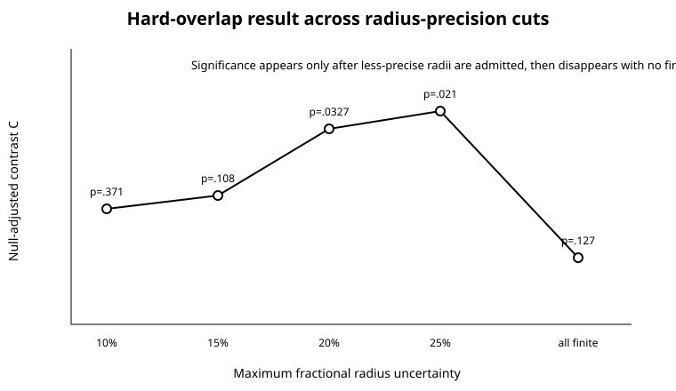
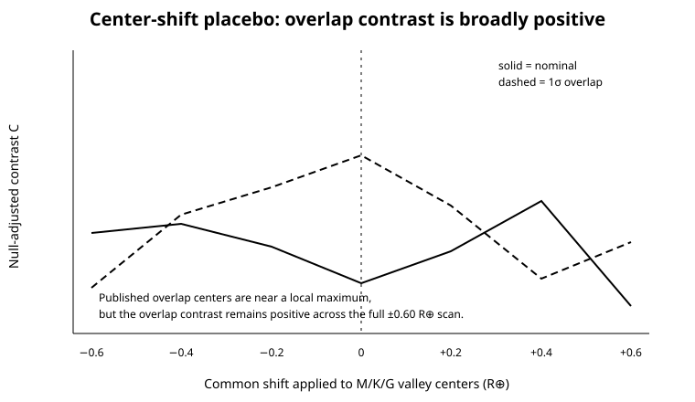

## 8. Robustness and falsification tests

### 8.1 Precision threshold

The hard-overlap result was not stable as precision increased. At the strictest 10% fractional-error cutoff, there were 41 pairs, 11 overlap-labeled valley pairs, and Fisher `p = 0.371`. At 15%, `p = 0.108`. The nominally significant value appeared at 20% (`p = 0.0327`) and 25% (`p = 0.0210`), then disappeared when all finite uncertainties were admitted (`p = 0.127`).

| Maximum fractional radius error | Pairs | Overlap valley pairs | C | Fisher p |
|---:|---:|---:|---:|---:|
| 10% | 41 | 11 | 0.103 | 0.371 |
| 15% | 65 | 19 | 0.113 | 0.108 |
| 20% | 74 | 24 | 0.170 | 0.0327 |
| 25% | 80 | 25 | 0.182 | 0.0210 |
| No finite cutoff | 179 | 111 | 0.061 | 0.127 |

A robust astrophysical signal need not monotonically strengthen with precision, especially in a small sample. Nevertheless, significance appearing only after admitting less precise radii is the opposite of what would be expected if overlap labels became more trustworthy.

### 8.2 Window width and match definition

At the primary 20% precision cutoff, hard-overlap Fisher p values were 0.056, 0.0327, 0.0134, 0.0690, and 0.0789 for valley half-widths of 0.08, 0.10, 0.12, 0.15, and 0.20 Earth radii. The result therefore depended on a narrow mid-range of widths rather than persisting across the plausible classification range.

Changing the size-match tolerance produced Fisher p values of 0.0858, 0.0327, 0.0305, and 0.0098 at 5%, 10%, 15%, and 20%. The direction is consistent, but the binary significance decision changes with the convention.

### 8.3 Signal quality and disposition

The overlap result failed stricter signal and disposition controls:

| Restriction | Pairs | Valley pairs | C | Fisher p |
|---|---:|---:|---:|---:|
| Primary, all PC/CP/KP | 74 | 24 | 0.170 | 0.0327 |
| Signal-to-noise >= 10 | 59 | 16 | 0.125 | 0.110 |
| Signal-to-noise >= 15 | 33 | 11 | 0.103 | 0.329 |
| Confirmed/known pairs only | 26 | 9 | 0.198 | 0.199 |
| PC-only pairs | 46 | 13 | 0.111 | 0.146 |

The point estimates often remained positive, but the evidence was not independently carried by either the higher-SNR or confirmed-only subset.

### 8.4 Baseline-transfer model

The difference-in-differences calculation implicitly transfers the non-valley physical enhancement to the valley class additively. To test that assumption, expected valley rates were also generated by multiplicative and logit-scale transfer. Under hard-overlap membership, the one-sided Poisson-binomial p values were 0.0364 for additive transfer, 0.0585 for multiplicative transfer, and 0.0523 for logit transfer. The nominal analysis was nonsignificant under all three models (`p = 0.521-0.637`). Thus even the overlap inference crossed the conventional threshold when the transfer scale changed.

### 8.5 Center-shift placebo

The hard-overlap contrast was positive for every common center shift tested from -0.60 to +0.60 Earth radii. The published centers yielded `C = 0.170`, near the upper end of the scan (96.7th percentile), but a broad positive response rather than a sharply localized peak. Nominal centers were only at the 31st percentile of their scan.

This does not prove that the effect is unrelated to the valley - the published overlap centers do lie near a local maximum - but it shows that the sign of the result is not specific to the measured valley location.

### 8.6 Nonadjacent-pair placebo contradicts localization

Seventeen systems supplied 28 nonadjacent pairs, defined as planets separated by at least one intervening observed TOI. Under nominal membership, only three nonadjacent pairs were valley-inclusive, too few for a stable rate comparison. Under the hard overlap rule, however, 13 nonadjacent pairs were valley-inclusive and none were size-matched, while 7 of 15 non-valley nonadjacent pairs were size-matched.

The nonadjacent overlap contrast was `C = 0.362`, more than twice the adjacent overlap estimate. The one-sided Fisher p value was 0.00543, the network-permutation p value was 0.000020 (the 50,000-draw resolution floor), and the conditional system-bootstrap 95% interval was 0.100 to 0.601.

This result is not presented as a new astrophysical detection. The nonadjacent sample is small, drawn only from higher-multiplicity systems, and its pairs are correlated. Its role is adversarial: an effect claimed to be localized to immediate neighbors should not become stronger when immediate adjacency is removed. The TESS overlap result therefore fails H2.

### 8.7 Independent implementation

A separate 89-line validation script read only the exported primary-pair table. It did not import the main pipeline. It independently reconstructed nominal and overlap labels, size-match indicators, one-sided Fisher tests, and Gaussian latent pair probabilities. It confirmed:

- 74 unique period-ordered edges and no duplicate edge keys;
- nominal counts of 1/10 versus 16/64 and Fisher `p = 0.2729969128798577`;
- overlap counts of 2/24 versus 15/50 and Fisher `p = 0.03265016953837952`;
- analytic expected latent pair count `10.333686632009826`;
- exact agreement with the primary summary for every audited quantity.

## 9. Discussion

### 9.1 Observed result

Three statements are directly supported by the computation.

First, current nominal TESS radii produce a positive but highly uncertain estimate of reduced size similarity around valley planets. The confidence interval is wide, all primary tests are nonsignificant, and power is low.

Second, a hard 1-sigma overlap rule changes the binary sample enough to produce borderline conventional significance. Algebraically, that rule expands each planet's membership window by its own uncertainty. In this sample it labels 24 pairs even though the expected latent count is about 10.3.

Third, the hard-overlap effect does not behave like the adjacency-localized Kepler result. It is stronger among nonadjacent TESS pairs and disappears under direct measurement-error propagation and several higher-quality restrictions.

### 9.2 Interpretation

The most economical interpretation is **classification-induced evidence inflation in a small, noisy cross-survey sample**. This does not mean the 14 overlap-only pairs are all non-valley pairs. It means their individual probabilities of genuine membership are too low for a binary label to preserve the information in the measurements. The overlap rule trades sensitivity for severe loss of positive predictive value, then analyzes all labels as equally certain.

A hard confidence-interval intersection rule is especially risky when the selection event itself is scientifically meaningful. In ordinary uncertainty reporting, a wider interval expresses less knowledge. Under overlap selection, a wider interval increases the chance of being classified into the special group. The direction of information is reversed: uncertainty becomes evidence for membership.

This failure mode is general. It can arise whenever objects are selected because their confidence intervals touch a narrow physical region - diagnostic thresholds, ecological transition zones, chemical phase boundaries, clinical reference ranges, or astronomical gaps - and the resulting labels are treated as ground truth. Probabilistic membership, hierarchical measurement-error models, or multiple-imputation-style propagation are preferable.

### 9.3 Relationship to the Kepler result

The TESS study neither reproduces nor refutes the Kepler result. The nominal sample is too small to distinguish a true absence of effect from insufficient power. Kepler radii under the Chance and Ballard default cut were much more precise: fractional uncertainty no greater than 5%, compared with the 20% TESS primary ceiling here [4]. Under such precise measurements, `w + sigma` differs less from `w`, so the overlap geometry is less distorting.

The correct cross-survey conclusion is therefore asymmetric:

- The TESS data do **not** provide independent confirmation at present.
- The TESS data do **not** establish that the Kepler result is false.
- They **do** show that directly transferring the hard overlap label to a noisier survey can generate an apparent replication unsupported by latent-radius propagation.

### 9.4 Speculation and future implications

It remains possible that a genuine valley-neighbor effect exists but requires a larger set of precisely characterized TESS multi-planet systems. The current analysis predicts what would make the test decisive: many more pairs with radius errors near or below 5%, homogeneous stellar-radius inference, and a preregistered hierarchical model that jointly estimates valley membership and within-system correlation. Follow-up refinements could move individual TOIs into or out of the latent valley sample without changing the methodological conclusion that uncertainty should not be converted into an expanded hard window.

The stronger nonadjacent signal may reflect chance, system-level selection, multiplicity differences, broad radius-dependent architecture, or residual catalog systematics. It should not be interpreted physically without a larger sample. Its value here is as a falsification result against immediate-neighbor specificity.

## 10. Limitations

1. **Candidate catalog.** The primary sample includes PC dispositions as well as CP/KP objects. False positives or revised system architectures may remain. Confirmed-only results were reported but are underpowered.
2. **Heterogeneous radii.** TOI radii and uncertainties are compiled from evolving follow-up information and are not a single homogeneous posterior analysis. Shared stellar-radius errors can correlate planet radii within a system.
3. **Gaussian approximation.** The latent-membership calculation treats reported uncertainties as approximately symmetric standard deviations. Some radius posteriors are asymmetric or non-Gaussian; the lognormal sensitivity model only partly addresses this.
4. **Fixed valley centers.** The adopted M/K/G centers are survey-specific empirical minima but do not model period dependence, stellar mass continuously, age, metallicity, or completeness. Center uncertainty and broad shifts were tested, but a full hierarchical valley surface was not fit.
5. **Small sample.** Only 10 nominal adjacent pairs were valley-inclusive. The negative nominal result is underpowered, and subgroup analyses should not be treated as definitive.
6. **Observed adjacency.** Adjacency refers to known transiting TOIs. Undetected planets can intervene, and TESS completeness differs by period, radius, stellar type, and observing baseline.
7. **Correlated edges.** Multi-planet systems contribute multiple edges. System bootstrapping and graph-preserving permutation reduce but do not eliminate all dependence concerns.
8. **Exploratory choices.** Although the central definitions were inherited from the closest study, this analysis was not preregistered. The extensive robustness grid is reported to expose rather than conceal researcher degrees of freedom.
9. **Archive cadence.** The live endpoint check on 8 August 2026 returned a file created on 14 March 2026 and covering Sectors 1-97. Later catalog releases may alter the sample and should be rerun from the included code.
10. **No causal claim.** The study measures an observational association and a classification-induced statistical effect. It does not identify a formation mechanism or establish that any individual planet experienced an impact.
